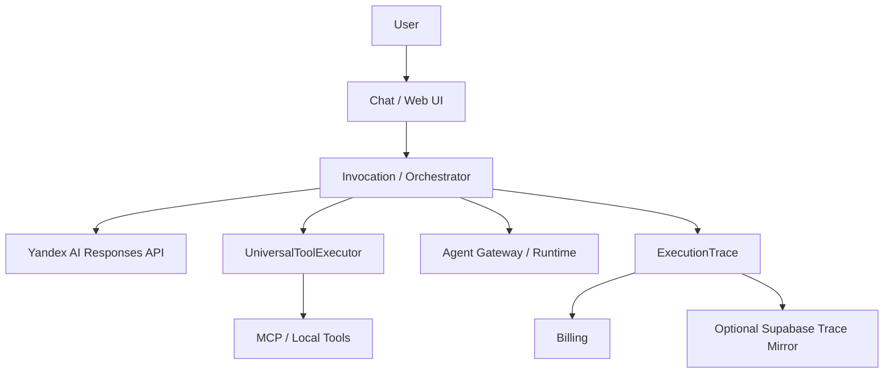

# Alice Pro

Alice Pro is a self-hosted AI assistant platform built around Yandex AI Studio, MCP/local tools, agent orchestration, Execution Trace, file handling, billing/treasury controls, and an Android WebView client.

The project is actively evolving. Some components are production-oriented, while agent, provider, runtime, and Android capabilities may still be experimental.

## What it does

- **AI chat** with Yandex AI Studio Responses API integration.
- **MCP and local tools** with a unified execution boundary.
- **Execution Trace** for provider requests, polling, tool execution, errors, timing, billing, and correlation.
- **Agent Gateway and runtime** for isolated invocation/session workflows.
- **Files and knowledge** through the file manager and vector-knowledge integrations.
- **Treasury and billing** for internal usage accounting and demo balances.
- **Departments** for domain-specific agent capabilities.
- **Android client** with WebView integration, update handling, logging, and a stable debug-build workflow.
- **Optional PostgreSQL backend** for shared deployments; SQLite remains the default local/Termux database.
- **Supabase trace mirror** as an optional operational/diagnostic integration.

## Architecture

The main execution path is deliberately explicit:



Requests, tool calls, polling and continuations carry scoped correlation information through `InvocationContext` and `ExecutionTrace`. Secrets are sanitized before persistent traces and logs.

## Current status

The repository currently has a working backend/CI path and a buildable Android debug path.

Core areas already integrated include:

- unified tool execution through `UniversalToolExecutor`;
- execution/session recovery tests;
- correlated trace viewer events;
- trace timing/correlation helpers;
- global provider-key lifecycle and rotation;
- anonymous first-launch identity bootstrap;
- Departments registry/API/UI;
- Agent Gateway with retry/rate/circuit controls;
- Supabase production migration workflow.

Treat advanced agent runtimes, branch environments, per-user provider credentials/quotas, Government workflows, Partner Relations, Kwork integration, and some AI-assisted UI features as roadmap/experimental work unless their corresponding issue is marked complete.

## Quick start

### Prerequisites

For the current validated development path:

- Python 3.12 for backend CI-compatible development.
- Java 17 for Android builds.
- Android SDK with API 37 installed for the current Android compile toolchain.
- Git.
- Optional: PostgreSQL 17 for shared deployments. Omit ALICE_DATABASE_URL for the default SQLite/Termux mode.
- Optional: a Supabase project for trace mirroring and production migrations.

### Backend

Create a virtual environment:

```bash
python3 -m venv venv
source venv/bin/activate
```

Install the repository dependencies:

```bash
python -m pip install -r requirements.txt
```

Create a local environment file:

```bash
cp .env.example .env
```

At minimum, configure:

```env
YANDEX_API_KEY=<your-yandex-api-key>
YANDEX_PROJECT_ID=<your-yandex-project-id>
YANDEX_BASE_URL=https://ai.api.cloud.yandex.net/v1
HOST=0.0.0.0
PORT=8080
SECRET_KEY=<random-secret>
ALICE_OWNER_ID=<stable-owner-id>
```

Start the application:

```bash
python app.py
```

Open:

```
http://localhost:8080
```

### Optional Supabase trace mirror

Configure the backend only:

```env
SUPABASE_URL=https://<your-project-ref>.supabase.co
SUPABASE_SERVICE_ROLE_KEY=<backend-only-secret>
```

The mirror is best-effort. A Supabase mirror failure must not become a failure of the main chat request.

### Android

The current Android module uses Java 17, compileSdk 37, targetSdk 35, and minSdk 26.

From the Android project:

```bash
cd android
./gradlew :app:testDebugUnitTest :app:assembleDebug
```

CI also accepts build metadata:

```bash
./gradlew --no-daemon \
  -PaliceBuildNumber=<build-number> \
  -PaliceCommitHash=<commit-sha> \
  :app:testDebugUnitTest :app:assembleDebug
```

The debug APK produced by CI is intended for development/testing. Release signing keys must never be committed.

## Configuration and secrets

Use `.env` or the deployment secret manager for credentials.

Never commit:

- Yandex API keys or IAM tokens;
- Supabase service-role keys;
- Cloud.ru credentials;
- MCP bearer tokens;
- signing keys/passwords;
- user passwords or session secrets.

Provider credentials are handled at the backend boundary. The current provider-key lifecycle is deployment-wide rather than per-user. See [provider key rotation](docs/provider-key-rotation.md).

For security-sensitive reports, follow [SECURITY.md](SECURITY.md).

## Development workflow

Production changes use:

```
Issue → branch → implementation → tests → PR → CI → merge → post-merge verification
```

Keep changes small enough to validate independently. Use the repository's Definition of Ready / Definition of Done and sprint workflow in [docs/development/sprint-workflow.md](docs/development/sprint-workflow.md).

See [AGENTS.md](AGENTS.md) and [CONTRIBUTING.md](CONTRIBUTING.md) for repository conventions.

## Testing

Backend:

```bash
python -m compileall -q .
pytest -q
```

Android:

```bash
cd android
./gradlew :app:testDebugUnitTest :app:assembleDebug
```

For database changes, keep the shared database path optional: SQLite is the default for local/Termux runs, while PostgreSQL is selected only with `ALICE_DATABASE_URL`. Supabase remains a separate backup/diagnostic concern.

## Troubleshooting

### Yandex returns 401/403

Check the project ID, API key permissions, model availability, and backend environment variables. Do not put provider credentials into frontend configuration.

### Supabase reports a migration or table error

Check the migration history and the production migration workflow logs. Do not invent ad-hoc destructive rollbacks. Follow [docs/supabase-migrations-deploy.md](docs/supabase-migrations-deploy.md).

### Android APK says the package conflicts

Check the installed package name and version code. The current application ID is `com.alicepro.mobile`, and CI build numbers are propagated into `versionCode`.

### Android UI is covered by system bars

Check the current window/insets handling in `MainActivity.kt` and test the APK on the affected Android version before changing WebView padding or fullscreen flags.

### Trace does not show a tool execution

Inspect the complete trace, including tool calls, events, errors, and continuation steps. Tool execution should pass through `UniversalToolExecutor`. Do not use only the user-visible assistant message as evidence of whether a tool ran.

## Documentation map

- [API documentation](API_DOCS.md)
- [Agent architecture](docs/agents/departments.md)
- [Runtime/serverless](docs/runtime_serverless.md)
- [MCP architecture](mcp_architecture_documentation.md)
- [Provider key rotation](docs/provider-key-rotation.md)
- [Supabase migrations](docs/supabase-migrations-deploy.md)
- [Sprint workflow](docs/development/sprint-workflow.md)
- [Security policy](SECURITY.md)
- [Support](SUPPORT.md)
- [Contributing](CONTRIBUTING.md)

## Roadmap

Major roadmap areas include:

- branch-aware preview environments;
- separate user agents and reusable AI sessions;
- Government Department workflows;
- Partner Relations;
- per-user provider credentials, quotas and rate limits;
- richer theme/voice assistance;
- resilient backup/failover providers;
- public release automation and versioned Android releases.

GitHub Issues are the source of truth for scope and acceptance criteria.

## License

Alice Pro is licensed under the MIT License. See [LICENSE](LICENSE).

