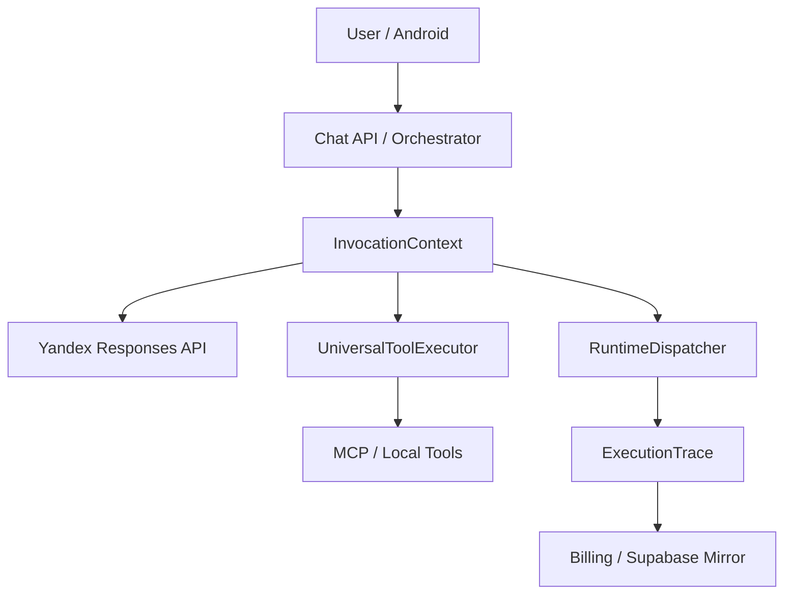

# Alice Pro

Alice Pro — self-hosted AI assistant platform around Yandex AI Studio, MCP/local tools, agent orchestration, execution traces, billing and an Android WebView client.

The repository is actively evolving. This README separates shipped behavior from open scope: Issues define implementation scope and acceptance criteria; docs define contracts and operating rules; Discussions capture questions and decisions.

## What is shipped

- **Yandex AI Studio Responses API** as the primary provider through the backend chat path.
- **Unified tool execution** through `UniversalToolExecutor`, including MCP and local tools.
- **Invocation context and execution trace** for provider requests, polling, tool calls, errors, timing, continuations and billing correlation.
- **Deterministic trace lifecycle**: snapshots are read-only and finalization is idempotent; see [execution trace lifecycle](docs/execution-trace-lifecycle.md).
- **Agent Gateway and RuntimeDispatcher** for runtime-scoped invocations. The target architecture is one Python process with managed threads/contexts; threads are not a hostile-code security boundary.
- **Alice GitHub agent**: issue/label-triggered workflow, headless runner, filesystem-only sandboxed tools, draft PR output and CI/review gates. See [Alice GitHub agent](docs/agents/alice-github-agent.md).
- **Compute energy accounting** based on measured CPU time and configured watts/price; if no electricity price is configured, the trace remains unpriced. See [compute energy billing](docs/compute-energy-billing.md).
- **Treasury and billing controls**, internal usage accounting and demo balances.
- **Files, knowledge and Departments** integrations, with optional Supabase trace mirroring.
- **Android debug client** with WebView integration, diagnostics, updates and a reproducible debug-build path.
- **SQLite by default** for local/Termux runs; PostgreSQL is optional for shared deployments.

## Architecture


```mermaid
flowchart TD
    U[User / Android] --> O[Chat API / Orchestrator]
    O --> C[InvocationContext]
    C --> Y[Yandex Responses API]
    C --> T[UniversalToolExecutor]
    T --> M[MCP / Local Tools]
    C --> R[RuntimeDispatcher]
    R --> X[ExecutionTrace]
    X --> B[Billing / Supabase Mirror]
```

Secrets are sanitized at the trace/log boundary. Provider requests, continuations and tool calls retain scoped correlation through `InvocationContext` and `ExecutionTrace`.

## Current status

The current `master` contains the merged trace, billing and Alice-agent work from PRs [#404](https://github.com/maksimp6/Chat/pull/404), [#407](https://github.com/maksimp6/Chat/pull/407), [#402](https://github.com/maksimp6/Chat/pull/402) and [#405](https://github.com/maksimp6/Chat/pull/405), plus the later restoration of the #407 tree. Master is protected: production changes go through a PR, CI/status checks, review and post-merge verification. The configured protection currently has the status-check gate enabled; named required check contexts must be added when the repository's CI check names are finalized.

Still experimental or roadmap unless the corresponding issue is complete:

- advanced branch-aware preview/runtime isolation;
- cloud and local browsing with Browser Emulator/BrowserShim self-testing;
- per-user provider credentials, quotas and rate limits;
- Government workflows, Partner Relations and Kwork integration;
- richer theme/voice assistance;
- resilient backup/failover providers;
- public release automation and versioned Android releases.

## Quick start

### Prerequisites

- Python 3.12
- Java 17
- Android SDK with API 37
- Git
- Optional PostgreSQL 17
- Optional Supabase project for trace mirroring/migrations

### Backend

```bash
python3 -m venv venv
source venv/bin/activate
python -m pip install -r requirements.txt
cp .env.example .env
python app.py
```

Open `http://localhost:8080`.

At minimum, configure `YANDEX_API_KEY`, `YANDEX_PROJECT_ID`, `YANDEX_BASE_URL`, `SECRET_KEY` and `ALICE_OWNER_ID`. Do not put provider credentials in frontend configuration.

SQLite is the default for local/Termux/proot Ubuntu use. Set `ALICE_DATABASE_URL` only when selecting PostgreSQL.

### Android

```bash
cd android
./gradlew :app:testDebugUnitTest :app:assembleDebug
```

The debug APK is for development/testing. Release signing keys must never be committed.

## Configuration and security

Use `.env` or a deployment secret manager. Never commit:

- Yandex API keys or IAM tokens;
- Supabase service-role keys;
- Cloud.ru credentials or MCP bearer tokens;
- signing keys/passwords;
- user passwords or session secrets.

For security-sensitive reports, follow [SECURITY.md](SECURITY.md). Runtime tools must respect approval boundaries and the repository's sandbox rules; do not use browser profiles, cookies or hidden credentials as test fixtures.

## Development workflow

```
Issue → branch → implementation → tests → PR → CI → review → merge → verification
```

Keep changes independently testable. Follow [AGENTS.md](AGENTS.md), [CONTRIBUTING.md](CONTRIBUTING.md) and the [sprint workflow](docs/development/sprint-workflow.md). Issues are the canonical source for scope and acceptance; a Discussion is not a substitute for an issue or a passing CI check.

## Testing

```bash
python -m compileall -q .
pytest -q
cd android && ./gradlew :app:testDebugUnitTest :app:assembleDebug
```

For frontend/runtime work, preserve the progressive-enhancement path and BrowserShim/VM tests. Do not introduce Playwright as a runtime dependency. Browser Emulator/self-testing work is tracked in [#409](https://github.com/maksimp6/Chat/issues/409).

## Documentation map

- [Documentation index](docs/README.md)
- [Architecture overview](docs/architecture/overview.md)
- [Integration coordination](docs/architecture/integration-coordination.md)
- [Current scope](docs/current-scope.md)
- [API overview](docs/api/overview.md)
- [MCP overview](docs/mcp/overview.md)
- [Agent architecture](docs/agents/overview.md)
- [Runtime Dispatcher policy](docs/runtime/runtime-dispatcher-policy.md)
- [Alice GitHub agent](docs/agents/alice-github-agent.md)
- [Compute energy billing](docs/compute-energy-billing.md)
- [Execution trace lifecycle](docs/execution-trace-lifecycle.md)
- [Provider key rotation](docs/provider-key-rotation.md)
- [Supabase migrations](docs/supabase-migrations-deploy.md)
- [Security policy](SECURITY.md)
- [Support](SUPPORT.md)

## Active issues and expected work

The main coordination issue is [#343](https://github.com/maksimp6/Chat/issues/343). Related scope includes:

- [#350](https://github.com/maksimp6/Chat/issues/350) — canonical one-process runtime architecture;
- [#351](https://github.com/maksimp6/Chat/issues/351) — integration staging and dependency order;
- [#227](https://github.com/maksimp6/Chat/issues/227) and [#223](https://github.com/maksimp6/Chat/issues/223) — frontend progressive enhancement;
- [#326](https://github.com/maksimp6/Chat/issues/326) and [#238](https://github.com/maksimp6/Chat/issues/238) — MCP/ChatGPT compatibility;
- [#254](https://github.com/maksimp6/Chat/issues/254) and [#256](https://github.com/maksimp6/Chat/issues/256) — plugin platform and autonomous development;
- [#340](https://github.com/maksimp6/Chat/issues/340) — provider-neutral cloud storage, Google Drive first;
- [#116](https://github.com/maksimp6/Chat/issues/116) — conversation agents;
- [#195](https://github.com/maksimp6/Chat/issues/195) — Android/release safety;
- [#104](https://github.com/maksimp6/Chat/issues/104) — public release;
- [#409](https://github.com/maksimp6/Chat/issues/409) — cloud/local browsing and self-testing.

Relevant Discussions include [Cloud.ru CLI Q&A #406](https://github.com/maksimp6/Chat/discussions/406) and [repository cleanup #393](https://github.com/maksimp6/Chat/discussions/393). They document open questions and decisions; they do not by themselves mark a feature complete.

## License

Alice Pro is licensed under the MIT License. See [LICENSE](LICENSE).
