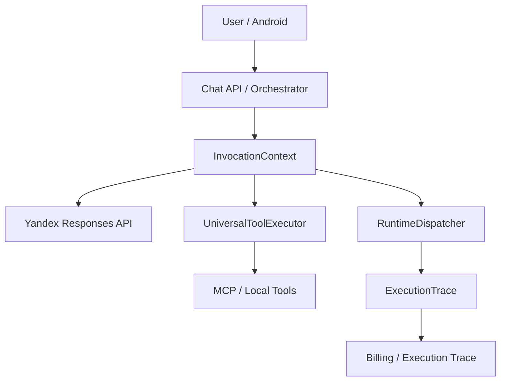

# Alice Pro

Alice Pro — self-hosted AI assistant platform around Yandex AI Studio, MCP/local tools, agent orchestration, execution traces, billing and an Android WebView client.

The repository is actively evolving. This README separates shipped behavior from open scope: Issues define implementation scope and acceptance criteria; docs define contracts and operating rules; Discussions capture questions and decisions.

## What is shipped

- **Yandex AI Studio Responses API** as the primary provider through the backend chat path.
- **Unified tool execution** through `UniversalToolExecutor`, including MCP and local tools.
- **Invocation context and execution trace** for provider requests, polling, tool calls, errors, timing, continuations and billing correlation.
- **Deterministic trace lifecycle**: snapshots are read-only and finalization is idempotent; see [execution trace lifecycle](docs/execution-trace-lifecycle.md).
- **Agent Gateway and RuntimeDispatcher** for runtime-scoped invocations. The target architecture is one Python process with managed threads/contexts; threads are not a hostile-code security boundary.
- **Alice GitHub agent**: issue/label-triggered workflow, headless runner, filesystem-only sandboxed tools, draft PR output and CI/review gates. See [Alice GitHub agent](docs/agents/alice-github-agent.md).
- **Compute energy accounting** based on measured CPU time and configured watts/price; if no electricity price is configured, the trace remains unpriced. See [compute energy billing](docs/compute-energy-billing.md).
- **Treasury and billing controls**, internal usage accounting and demo balances.
- **3D Printing Business**: quote calculation, owner-scoped orders and settlement, realized P&L, finance/payback tracking and AI-first purchase assessment. See [3D Printing Business](docs/printing3d.md).
- **Files, knowledge and Departments** integrations with local Execution Trace persistence.
- **Android debug client** with WebView integration, diagnostics, updates and a reproducible debug-build path.
- **SQLite by default** for local/Termux runs; PostgreSQL is optional for shared deployments.

## Питомцы


**Плюш** — мягкий, немного неуклюжий дракон из недорогого плюша. Он живёт рядом со строкой ввода: думает во время запроса, ждёт подтверждения инструмента, радуется готовому ответу и реагирует на ошибки. Нажмите на него, чтобы поздороваться.

Выбор: **Настройки → Оформление → Питомцы → Плюш / Без питомца**. Настройка сохраняется на устройстве и не передаётся модели. Анимация учитывает системное уменьшение движения и приостанавливается в скрытой вкладке.

Плюш — первый питомец в каталоге. Изображения хранятся в репозитории; подключение к ChatGPT для работы питомца не требуется. Подробнее: [модуль питомцев](docs/frontend/pets.md).

## Architecture


```mermaid
flowchart TD
    U[User / Android] --> O[Chat API / Orchestrator]
    O --> C[InvocationContext]
    C --> Y[Yandex Responses API]
    C --> T[UniversalToolExecutor]
    T --> M[MCP / Local Tools]
    C --> R[RuntimeDispatcher]
    R --> X[ExecutionTrace]
    X --> B[Billing / Execution Trace]
```

Secrets are sanitized at the trace/log boundary. Provider requests, continuations and tool calls retain scoped correlation through `InvocationContext` and `ExecutionTrace`.

## Current status

As of 2026-09-29, `master` includes the fail-closed merge gate, canonical formatter lifecycle, runner dependency caching and CI timing telemetry, deduplicated Python/frontend test execution, lazy PostgreSQL test reset, async runtime concurrency/cancellation/timeout coverage, Cloud.ru Secret Management hardening, and the Container Apps v2 client contract ([changelog](docs/changelog.md)). Copilot review is automatic; maintainers request one final Codex review only after the current head is green and ready to merge.

These are repository capabilities, not evidence that the public production deployment, external MCP connection, or live Cloud.ru Container Apps rollout has been verified. The current `master` is protected by the documented fail-closed workflow: a PR must be synchronized with current `master`, required checks must be green on the exact current head, review threads must be resolved, and merge happens through the protected GitHub path.

The Cloud.ru platform migration is tracked in [#440](https://github.com/maksimp6/Chat/issues/440). The Container Apps v2 client and deterministic contract tests are now in `master`, but the baseline deployment path is still awaiting live validation against a real Cloud.ru project. Object Storage migration, durable background workers, and production cutover remain separate work.

Still experimental or roadmap unless the corresponding issue is complete:

- advanced branch-aware preview/runtime isolation;
- cloud and local browsing with Browser Emulator/BrowserShim self-testing;
- per-user provider credentials, quotas and rate limits;
- Government workflows, Partner Relations and Kwork integration;
- richer theme/voice assistance;
- resilient backup/failover providers;
- public release automation and versioned Android releases.

## Quick start

### Prerequisites

- Python: backend CI uses 3.14; Ruff targets 3.12.
- Git.
- Optional PostgreSQL 17, with `requirements-postgres.txt`.
- For Android builds only: Android SDK API 37 and Gradle 9.5.0. CI runs Gradle with Java 25 and stages the embedded runtime with Python 3.13; the Android module declares JVM toolchain 17.

### Backend

```bash
python3 -m venv venv
source venv/bin/activate
python -m pip install -r requirements.txt
cp .env.example .env
```

Copy `.env.example` only for a fresh installation. Replace its placeholders and remove unused integration examples before starting. For local development, set `HOST=127.0.0.1` and configure a persistent `ALICE_PROVIDER_CREDENTIAL_KEY` before saving provider credentials.

Start the backend with `python app.py`. Open `http://localhost:8080` when using the template's `PORT=8080`; without `PORT`, `app.py` defaults to `5000`. In **Провайдеры**, save the Yandex API key together with its Project ID. The current web runtime resolves both from the active database credential; environment-only `YANDEX_API_KEY` / `YANDEX_PROJECT_ID` values do not configure the chat. See the [installation guide](docs/setup/installation.md) and [provider-key lifecycle](docs/provider-key-rotation.md).

SQLite is the default for local/Termux/proot Ubuntu use. Set `ALICE_DATABASE_URL` only when selecting PostgreSQL.

### Android

```bash
cd android
python scripts/stage_python.py
gradle --no-daemon :app:testDebugUnitTest :app:assembleDebug
```

The debug APK is for development/testing. Release signing keys must never be committed.

## Configuration and security

Use `.env` or a deployment secret manager. Never commit:

- Yandex API keys or IAM tokens;
- Cloud.ru credentials or MCP bearer tokens;
- signing keys/passwords;
- user passwords or session secrets.

For security-sensitive reports, follow [SECURITY.md](SECURITY.md). Runtime tools must respect approval boundaries and the repository's sandbox rules; do not use browser profiles, cookies or hidden credentials as test fixtures.

## Development workflow

```
Issue → branch → implementation → tests → PR → CI → review → merge → verification
```

Keep changes independently testable. Follow [AGENTS.md](AGENTS.md), [CONTRIBUTING.md](CONTRIBUTING.md) and the [sprint workflow](docs/development/sprint-workflow.md). Issues are the canonical source for scope and acceptance; a Discussion is not a substitute for an issue or a passing CI check.

## Testing

```bash
python -m compileall -q .
pytest -q
cd android
python scripts/stage_python.py
gradle --no-daemon :app:testDebugUnitTest :app:assembleDebug
```

For frontend/runtime work, preserve the progressive-enhancement path and BrowserShim/VM tests. Do not introduce Playwright as a runtime dependency. Browser Emulator/self-testing work is tracked in [#409](https://github.com/maksimp6/Chat/issues/409).

## Documentation map

- [Documentation index](docs/README.md)
- [Питомцы](docs/frontend/pets.md)
- [Architecture overview](docs/architecture/overview.md)
- [Integration coordination](docs/architecture/integration-coordination.md)
- [Current scope](docs/integration/current-scope.md)
- [API overview](docs/api/overview.md)
- [MCP overview](docs/mcp/overview.md)
- [3D Printing Business](docs/printing3d.md)
- [Agent architecture](docs/agents/overview.md)
- [Runtime Dispatcher policy](docs/runtime/runtime-dispatcher-policy.md)
- [Alice GitHub agent](docs/agents/alice-github-agent.md)
- [Compute energy billing](docs/compute-energy-billing.md)
- [Execution trace lifecycle](docs/execution-trace-lifecycle.md)
- [Provider key rotation](docs/provider-key-rotation.md)
- [Security policy](SECURITY.md)
- [Support](SUPPORT.md)

## Active issues and expected work

Cloud.ru migration is coordinated in [#440](https://github.com/maksimp6/Chat/issues/440); canonical AI execution and repository layout are tracked in [#433](https://github.com/maksimp6/Chat/issues/433) and [#430](https://github.com/maksimp6/Chat/issues/430). Earlier architecture coordination remains in [#343](https://github.com/maksimp6/Chat/issues/343). Related scope includes:

- [#350](https://github.com/maksimp6/Chat/issues/350) — canonical one-process runtime architecture;
- [#351](https://github.com/maksimp6/Chat/issues/351) — integration staging and dependency order;
- [#227](https://github.com/maksimp6/Chat/issues/227) and [#223](https://github.com/maksimp6/Chat/issues/223) — frontend progressive enhancement;
- [#326](https://github.com/maksimp6/Chat/issues/326) and [#238](https://github.com/maksimp6/Chat/issues/238) — MCP/ChatGPT compatibility;
- [#254](https://github.com/maksimp6/Chat/issues/254) and [#256](https://github.com/maksimp6/Chat/issues/256) — plugin platform and autonomous development;
- [#340](https://github.com/maksimp6/Chat/issues/340) — provider-neutral cloud storage, Google Drive first;
- [#116](https://github.com/maksimp6/Chat/issues/116) — conversation agents;
- [#195](https://github.com/maksimp6/Chat/issues/195) — Android/release safety;
- [#104](https://github.com/maksimp6/Chat/issues/104) — public release;
- [#409](https://github.com/maksimp6/Chat/issues/409) — cloud/local browsing and self-testing.

Relevant Discussions include [Cloud.ru CLI Q&A #406](https://github.com/maksimp6/Chat/discussions/406) and [repository cleanup #393](https://github.com/maksimp6/Chat/discussions/393). They document open questions and decisions; they do not by themselves mark a feature complete.

## License

Alice Pro is licensed under the MIT License. See [LICENSE](LICENSE).
