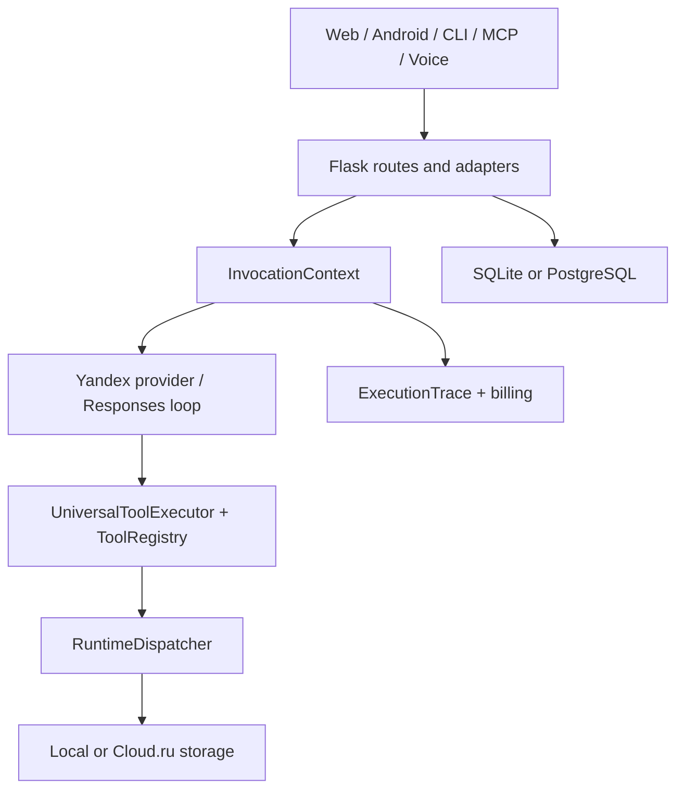

# Общая архитектура Alice Pro

Этот документ описывает код в текущем `master`. Планы и открытые интеграции
указаны отдельно и не считаются production-возможностями.

## Канонический путь запроса

Новый интерфейс подключается как адаптер к этому пути и не создаёт отдельный
цикл «модель → инструменты → модель». Подробный контракт зафиксирован в
[AI execution pipeline](ai-execution-pipeline.md).

## Слои и фактические модули

### Интерфейсы и транспортные адаптеры

- `app.py` и route-модули — Flask-приложение и HTTP API;
- `static/` и `templates/` — web UI без React/Vite в основном runtime;
- `android/` — Android WebView-клиент;
- `cli_agent.py` — CLI/Termux-клиент к backend API, без собственного model loop;
- `voice_routes.py` — SpeechKit STT/TTS и передача распознанного текста в общий
  чат-клиент;
- `mcp_routes.py` и `chatgpt_mcp.py` — MCP/ChatGPT transport;
- `alice_agent_runner.py` — GitHub issue adapter с invocation и финальным trace.

### Выполнение модели и инструментов

- `invocation/` хранит идентичность и жизненный цикл запуска;
- `yandex_client.py`, `yandex_client_modules/` и `responses_tool_loop.py`
  реализуют основной provider path;
- `tool_registry.py` нормализует локальные, MCP и cloud tools;
- `universal_tool_platform.py` — единая граница выполнения tool calls, approvals
  и policy;
- `runtime/dispatcher.py` владеет runtime-scoped доступом к БД, filesystem,
  network/process, MCP/tool registry и storage.

Python threads — единицы выполнения, а не security boundary. Runtime-код не
может обходить dispatcher и напрямую брать ресурсы другого runtime; правила и
проверки описаны в [Runtime Dispatcher policy](../runtime/runtime-dispatcher-policy.md).

### Данные и storage

- `db.py` использует SQLite по умолчанию и PostgreSQL только при заданном
  `ALICE_DATABASE_URL`;
- conversations, settings, invocations, provider credentials и traces хранятся
  через backend data layer; Supabase из runtime удалён;
- `storage.py` задаёт provider-neutral `StorageProvider` и локальный sandboxed
  adapter;
- `cloud/cloudru/object_storage.py` реализует S3-compatible Cloud.ru adapter.
  Наличие адаптера не означает, что production уже переключён на него: provider
  и dispatcher credential resolver должны быть настроены явно.

### Наблюдаемость и эксплуатация

- `trace_manager.py` и `invocation/trace.py` связывают provider requests, tool
  calls, ошибки, timing и billing; snapshot не финализирует trace;
- `logger.py` пишет ротируемые файлы в `logs/`, но логи не заменяют
  `ExecutionTrace`;
- `cloud/tools.py` предоставляет provider-neutral cloud tools и budget guard;
- `scripts/pg_backup.sh` выполняет PostgreSQL backup, verify и explicit-target
  restore;
- `agent_office/observer.py` формирует GitHub-сводку о работе агентов, но ничего
  не dispatch/merge.

## Что ещё не подтверждено как production

- успешный публичный deploy текущего `master` и внешний MCP smoke test;
- Container Apps baseline из открытого PR;
- отдельный durable worker для фоновых задач;
- полная PostgreSQL-нейтральность всего приложения;
- автоматическое подключение Cloud.ru Object Storage к каждому runtime;
- Cloud.ru A2A adapter из открытого PR.

Текущий статус изменений репозитория приведён в [журнале](../changelog.md), а
операционный runbook — в [production deployment](../production-deployment.md).
